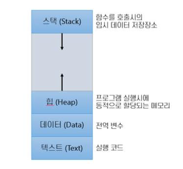
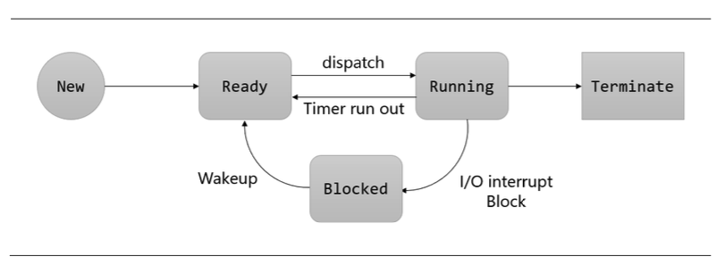

# 프로세스

프로세스란 컴퓨터에서 연속적으로 실행되고 있는 프로그램을 의미한다, 종종 작업(Task)와 같은 의미로 사용

프로그램은 일반적으로 보조 기억 장치에 저장되어 있는 실행 코드를 뜻함

프로세스는 프로그램을 구동하여 프로그램 자체와 프로그램의 상태가 메모리상에서 실행되는 작업 단위를 지칭

- 텍스트 섹션

​	코드를 실행하기 위해 저장된 영역으로, 코드 섹션이라고도 부름. 프로그램을 실행시키기 위해 구성되는 것들이 저장되는 영역

​	명령문이 저장되며, 제어문, 함수, 상수 등 또한 저장된다. 프로그램의 실행동안 크기가 고정된다

- 데이터 섹션

  전역 변수, static 변수 등이 저장됩니다. 일반적으로 응용 프로그램 진입전에 선언되어 프로그램 종료시까지 메모리에 남아 

  있다. 초기화 된 변수 영역과 되지않은 영역으로 나뉘며, 초기화 되지 않은 영역을 BSSd이라고 부른다

  

- 힙 섹션

​	사용자에 위해 관리되는 영역으로, 동적으로 할당되는 변수와 new 연산자로 생성되는 참조 타입의 객체들이 저장되는 영역

- 스택 섹션

 	함수를 호출할 떄 함수의 매개변수, 지역변수, 복귀 주소등을 포함하는 활성화 레코드가 저장되는 영역

## 프로세스 상태

- Dispacth

​	Ready 리스트의 맨 앞에 있던 프로세스가 CPU를 점유하게 되는것, 즉 준비 상태에서 실행 상태로 바뀌는 것	

- Block

​	실행 상태의 프로세스가 허가된 시간을 다 쓰기 전에 입출력 동작을 필요로 하는 경우 프로세스는 CPU를 스스로 반납하고

​	보류 상태로 넘어 감

- Wakeup

​	입출력 작업 종료 등 다리던 상태가 일어났을 때 보류 상태에서 준비 상태로 넘어감

- Timeout

​	운영체제는 프로세스가 프로세서를 계속 독점해서 사용하지 못하게 하기 위해 clock interrupt를 두어서 프로세스가 일정 

​	시간 동안만 (시분할 시스템의 time slice) 프로세서를 점유할 수 있게 한다.

## 프로세스간 통신

- 경쟁조건 (Race Condition) 

  둘 이상의 프로스세가 공유 메모리를 읽고 기록할 때 마지막 결과는 어떤 프로세스가 수행하였는가에 의존

- 임계 구역(Critical Section)

​		둘 이상의 프로세스가 공유 자원에 접근할 때, 공유 메모리에 접근하는 코드의 일부분

- 상호 배제(Mutual Exclusion)

​		임계 구역을 어느 시점에서 단지 한 개의 프로세스만이 사용할 수 있도록 하며, 다른 프로세스가 현재 사용중인 임계 구역

​		에 대해 접근하려 할 때 이를 금지하는 행위

